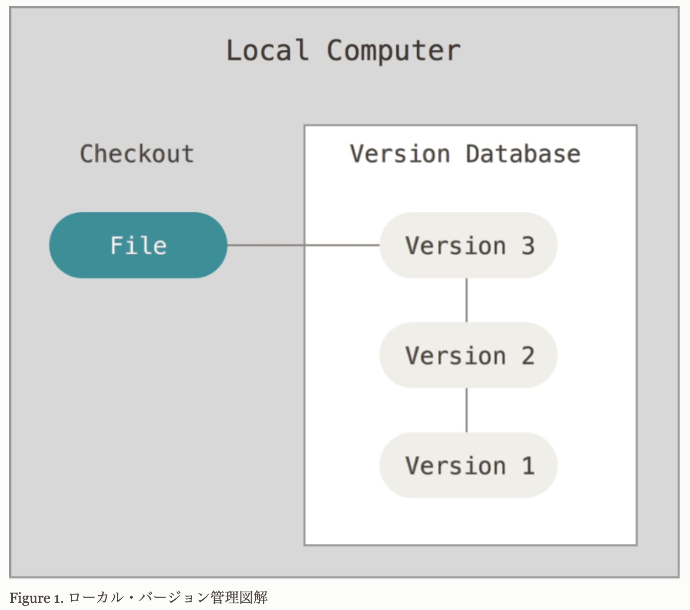

## 記事構成

1. React の基礎
2. JSX
3. 環境構築
4. props
5. import-export
6. component
7. useState_1
8. LifeCycle
9. useEffect
10. UseCase



## 1.React

## DOM 要素と React 要素

- React を動作させるために使用するライブラリ
  -- React => ビューを構築するためのライブラリ
  -- ReactDOM => React で構築されたビューをブラウザで構築するためのライブラリ
  -- ビュー => ソフトウェア開発におけるビューとは利用者への表示や操作の受け付け（ユーザーインターフェース）を担当する部分のことをビューという
  　　- MVC（Model-View-Controller）というよく知られる設計モデルがある
- まず普通の DOM と要素
  -- DOM とは[Document Object Model]　 HTML 要素 にアクセスする窓口

## React を使用する目的

- 効率の良い再描画[レンダリング]を行うこと

## Facebook 社が開発した UI ライブラリ

- モジュール < パッケージ < ライブラリ　※https://zenn.dev/nekoallergy/articles/0adf4d57acf9b4

## コンポーネントを組み合わせて Web の画面を作っていく

## React が登場するまでの Web の画面描画

- ブラウザは HTML という文書（ドキュメント）を画面に描画する
- 描画する HTML はツリー構造（要素と要素が繋がっている）になっていて変更する際（User がアクションを加えた時）に DOM を使う
- DOM とは[Document Object Model]　 HTML にアクセスする窓口
- HTML を変更するにはブラウザの DOM を変更する
- DOM を直接変更して変更した HTML を再描画するのはコストが高い

## ブラウザで DOM 操作、変更から仮想 DOM へ

- ブラウザの DOM ツリーを JavaScript のオブジェクトとして扱う（記述することでオブジェクトになる？だから JS ファイルだけで動く？）
- 作った JavaScript のオブジェクトは JavaScript エンジンを使って操作する
- そうすることでブラウザに負荷をかけずにコストが低く効率の良い再描画[レンダリング]を行うことができる

## 仮想 DOM であれば DOM の状態を JavaScript で管理することができる

- その仮想 DOM が React のコンポーネントである
- React のコンポーネント見た目だけではなく、「機能、状態をもった UI」である

## 差分描画のしくみ

- 差分描画があることで React は効率的に必要な箇所を書き換えることが出来る
- React を使ってしっかり作れば、通常の HTML,CSS,JavaScript で作るよりもシンプル、綺麗、UX が良い App を作ることが出来る
- 仮想 DOM で変更があった箇所、差分のみを描画してその影響を受ける

## コンポーネント

- 通常の class や関数
- 見た目と機能を持つ UI
- コンポーネントを組みわせてページを描画する
- 2 種類のコンポーネント
  - Class Component
  - Functional Component
- React Hooks の登場で 2 種類のコンポーネントで使える機能に差がなくなった

- コンポーネントを使う目的

  - 再利用するため
  - コードの見通しをよくする
    - 1 コンポーネント 1 ファイル
    - ファイルを分けることでコードが読みやすくなる
  - 変更に強くするため
    - 修正が局所的

- コンポーネントの基本的な使い方
- 1 ファイル 1 コンポーネントにする目的
  - コンポーネントの責務を明確にする
  - 管理しやすくなるため
  - 再利用するため
- 親コンポーネント
  - 親コンポーネントで子コンポーネントを import
- 子コンポーネント

  - 子コンポーネントで自分自身を export (親コンポーネントに import されるため)
  - 子コンポーネントは親コンポーネントに import されて使用される

- props でデータを受け渡す

  - 子コンポーネントの引数に props を指定する
  - 親コンポーネントから受け取った props を基に子コンポーネントが働き最終的に親コンポーネントに子コンポーネントの処理結果を渡すイメージ
  - 親コンポーネント → props → 子コンポーネント → 処理実行 → 　処理結果 → 親コンポーネント → 描画
  - 子コンポーネントは親コンポーネントの props に対して臨機応変、動的に処理出来るよう作る必要がある
  - 逆に親コンポーネントではどのようなデータを表示したいのか?子に渡したいのか？をきちんと指定していく　指定しないと大体エラー
  - 親コンポーネントもクライアントからの入力値を受け取る場合のあるのでそれに対しても処理出来るようにしておくことが肝要
  - 固定値は極力書かず、抽象的に構成する

- props で受け渡せるデータ

  - 文字列、数値、真偽値、配列、オブジェクト、日付など何でも OK
  - 変数を渡すことも可能
  - props のデータは{}に記述
  - 文字列は{}なしでも OK

- コンポーネントの再利用
  - 同じコンポーネントをいくつも利用することができる
  - 配列データを map()メゾットで処理するのが一般的

<!-- ## 4. props

- props の役割
  - データを受渡す
  - 関数やメゾットの引数
  - 入力値
  - 子コンポーネントの引数に props を指定する
- props で受け渡せるデータ

  - 文字列、数値、真偽値、配列、オブジェクト、日付など何でも OK
  - 変数を渡すことも可能
  - props のデータは{}に記述
  - 文字列は{}なしでも OK
  <!-- - context


  - グローバル変数
  - モジュールグローバルな変数 --> -->

## 5. import-export

- import-export する目的
  - 別ファイル（コンポーネント）を使う為
- JavaScriot のモジュール機能基礎
  - プログラムをモジュールと言う単位に分割する
  - 原則 1 ファイル 1 モジュール
  - 必要なときに必要なモジュールのみ読み込む
- import-export の種類

  - 1. default export
    - 名前なし export
    - 推奨される export 方法
    - 1 ファイル 1export
    - 1 度宣言したアロー関数を default export
    - 名前付き関数宣言と同時に default export
  - 2. default import

    - 名前なし import
    - default export したモジュールをそのまま読み込む
    - import モジュール名 from 'ファイルパス' で宣

      言

  - 3. 名前つき export
    - 1 ファイルから複数モジュールを export したいとき
      - ヘルパー関数を 1 モジュールで複数作った場合、関数（名前）毎に export する
    - React ではエントリポイントでよく使う
      - エントリポイントとは作ったコンポーネントを集合させるようなイメージ
      - index.js コンポーネント（エントリポイントにすることが多い,表示ページでは無いことに注意）に一旦置くイメージ
      - エントリポイントに名前付き export することで、各モジュールで import する時にまとめて import 出来る
    - エントリポイントでは別名 export も併用する
      - エントリポイントのファイル例
    ```
    export { default as Title } from './Title'
    export { default as Article } from './Article'
    export { default as Content } from './Content'
    ```
  - 4. 名前つき import
    - 1 ファイルから複数モジュールを import する
    - エントリポイントから複数コンポーネントをまとめて読み込む
      - エントリポイントから名前付き import する時のファイル例
      ```
      import { Title, Article, Content } from './エントリポイント'
      ```

## 6. state 1

- Hooks とは

  - 復習
  - React コンポーネントにはクラスコンポーネントとファンクションコンポーネントがある
  - クラスコンポーネントでしか使用することができなかった state と LifeCycle
    - state:コンポーネント内で状態を管理する機能
    - Lifecycle:コンポーネントの時間の流れに基づく機能
  - Hooks によりファンクションコンポーネントでも使用できるようになる
  - Hooks=クラスコンポーコンポーネントの機能に接続する

- state を使用する理由
  - state とは状態　現在のコンポーネントの状態（値）
  - React コンポーネントの値を書き換えるため state を使用する
    - React コンポーネントの要素を DOM で直接書き換えること(document.getElementById)は出来るが、  
      仮想 DOM を使用するメリットが失われてパフォーマンスが落ちるので Bad
    - そこで使用するのが state であり、コンポーネントがもともと持っている値（state）を  
      新しい値（state）を使って再描画（レンダリング）させるのが Good
- React コンポーネントが再描画されるきっかけ

  - state（状態）が変更されたとき
  - props（入力値）が変更されたとき

- Hooks:useState の使い方

  - useState とは状態を管理する関数で React がデフォルトで用意したオブジェクト、メゾットというイメージ
  - なのでコンポーネントで使用する際は、インポートする

  1. useState 関数 による state の宣言（要するに関数を宣言する）

  ```JavaScript:title=useState宣言　※これは構文、決まり（分割代入のイメージ）
  const [state(現在の状態),setState(更新関数命名)] = useState(initialState(初期値設定))

  ```

  - 「useState（関数）を使うと現在の状態（state）とそれを更新するための関数（setState）が返ってきますよ」と覚える
  - そして「その更新するための関数、更新関数（setState）に新しい値（newState）を渡すと state の更新ができますよ」と覚える

  2. state の更新

  ```JavaScript:title=stateの更新構文
  setState（更新関数）(newState（新しい値）)

  ```

  3. 具体例

  ```JavaScript:title=1.メッセージの状態｜2.いいねの状態｜3.サイト反映の状態
  1. const [message,setMessage] = useState('130 is cool');
  2. const [likes,setLikes] = useState(0);
  3. const [isPublished,setIsPublished] = useState(false);
  ```

- props と state の違い

- 両者とも再描画のきっかけにはなるが...

  - porps は引数のようにコンポーネントに渡される値
    - 親のコンポーネントから子のコンポーネントに受け渡すもの
  - state はコンポーネントの内部で宣言・制御される値

- state を props に渡す

  - state はコンポーネントの内部で制御されるとあるが、
  - 大抵のパターンは state を更に子のコンポーネントに渡していくことが多い

- 以下自分なりにまとめてみる　現段階の理解なので、また改善する

  - 大概の流れが以下
    - useState で更新関数宣言
    - 更新関数に引数を与えて状態を変える為、更新関数に引数を与える newState 関数（自分で命名）を宣言（入れ子にして引数渡すイメージ）
    - newState 関数に引数を与えるコンポーネントを作成して props に newState 関数を渡す
    - または newState 関数に引数を与えるイベントを持った HTML タグ要素を作成してイベントで得られる値を newState 関数の引数として渡す

- state を props に渡すときの基本

  - 更新関数はそのまま props として渡さず関数化（更新関数に引数を与える関数（newState 関数）に）してから渡す
  - 関数を props に渡すときは注意する　※以下説明

- props へ関数（更新関数をそのままでは無く関数化した newState 関数（自分で命名））を渡す際の注意点

  - OK な関数の渡しかた
  - 関数自体かコールバック関数をを渡す

  ```
  <PublishedButton isPublished={isPublished} onClick={publishArticle} />
  // 関数そのもの（関数名だけ）をpropsとしてわたすはGood
  <PublishedButton isPublished={isPublished} onClick={()=> publishArticle()} />
  // コールバック関数をpropsとしてわたすはGood
  ```

  - NG な関数の渡しかた（無限レンダリングが発生する）
  - props にわたす時に関数を実行する関数をわたす

  ```
  <PublishedButton isPublished={isPublished} onClick={publishArticle（）} />
  // 実行してしまう関数をpropsとしてわたすはBad
  ```

  ## 7. 頻出する useState のケース 3 選

  - useState は更新関数の使い方が非常にポイントになってくる

  - 1. 引数(ユーザーの入力など)を使って state を更新する

  - 使用ケース
    - 入力フォームでよく使う
    - フォームに何かを入力してその値を state として管理するっていうのは頻出パターン

```
import { useState } from "react";
const TextInput = () => {
  const [name, setName] = useState("");
  const handleName = (event) => {
    setName(event.target.value);
    // newState関数(handleName関数)のパラメータであるeventを更新関数（setName関数）に渡す
  };
  return (
    <input onChange={(event) => handleName(event)} type={"text"} value={name} />
    // onChangeイベントでnewState関数(handleName関数)に引数を渡す
  );
};

export default TextInput
```

- 2. prevState を活用して state を更新する

- prevState とは

  - useState の更新関数で使える特殊な値
  - prevState は更新前の state
  - 更新前の state を引数(prevState)として受け取って使えますよ
  - prevState に変更を加えて return できる

- 使用ケース

  - カウンターでよくつかう　カウントアップ、カウントダウン
  - 以前の配列を参照して、すでに含まれている値だったらそこから削除するし、
  - まだ含まれていない値だったら配列に追加するみたいな使い方もある

- ２つの書き方があるが、必ず prevState を使用したほうが良い
  - 通常、更新をするまでに少しラグが発生する
  - prevState を使用した場合、必ず更新前の状態を参照にする
  - prevState を使用しない場合は、更新前の状態がラグの為更新されていなければ参照できない

```
import { useState } from "react";

const Counter = () => {
  const [count, setCount] = useState(0);
  const countUp = () => {
    setTimeout(() => setCount((prevState) => prevState + 1), 1000);
  };
  const countDown = () => {
    setTimeout(() => setCount((prevState) => prevState - 1), 1000);
  };
  return (
    <div>
      <p>良いカウンター</p>
      <p>現在のカウント数: {count}</p>
      <button onClick={countUp}>up</button>
      <button onClick={countDown}>down</button>
    </div>
  );
};

export default Counter;
```

```
import { useState } from "react";

const BadCounter = () => {
  const [count, setCount] = useState(0);
  const countUp = () => {
    setTimeout(() => setCount(count + 1), 1000);
  };
  const countDown = () => {
    setTimeout(() => setCount(count - 1), 1000);
  };
  return (
    <div>
      <p>良くないカウンター</p>
      <p>現在のカウント数: {count}</p>
      <button onClick={countUp}>up</button>
      <button onClick={countDown}>down</button>
    </div>
  );
};

export default BadCounter;
```

- 3. true/false の state を更新する

  - 使用ケース

    - ON/OFF を切り替えるボタンを作る
    - true/false を切り替える

  - ポイント
    - prevState で受け取った値を!で反転して return する
    - 三項演算子によって open が true/false で表示を切り替える

```
import { useState } from "react";

const ToggleButton = () => {
  const [open, setOpen] = useState(false);
  const toggle = () => {
    setOpen((prevState) => !prevState);
  };

  return <button onClick={toggle}>{open ? "open" : "close"}</button>;
};

export default ToggleButton;
```

## 8. LifeCycle

- Lifecycle とは

  - コンポーネントが生まれてから破棄されるまでの時間の流れ
  - ライフサイクルメゾットを使うとその時点に応じた処理を実行できる
  - ClassComponent 時代は以下のメゾットが頻出
    - componentDidMount() コンポーネントが配置される(生まれる)期間
    - componentDIdUpdate() コンポーネントが変更される(成長する)期間
    - componentWillUnmount() コンポーネントが破棄される(消去)期間
  - Hooks 時代からは useEffect でライフサイクルを表現

  - レンダリングされたときに何かしらの処理を実行しますよ　というのが useEffect

- Hooks:useeffect の使い方
- trahack さんの動画教材を実行しつつ、参考サイトの合わせ技で理解する
- 現時点で完璧に理解することは不可能
- 苦しんでやっても覚えにくいから、楽しんでやること
- とう行くことでハンズオンに切り替え
- とにかく 8/16 からハンズオンばかり実行しつつ、基本をメモ
- 移動中はハンズオン教材探し　かつ　昼休み本屋さんでハンズオン探し
