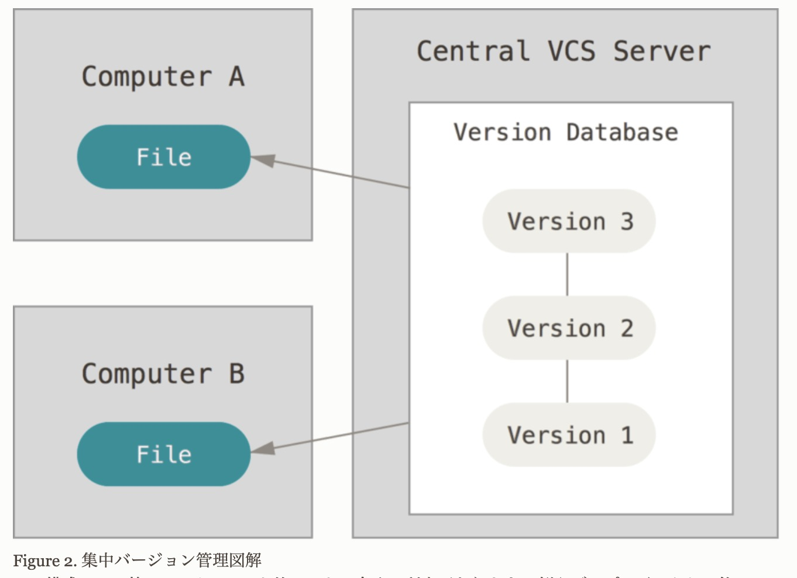
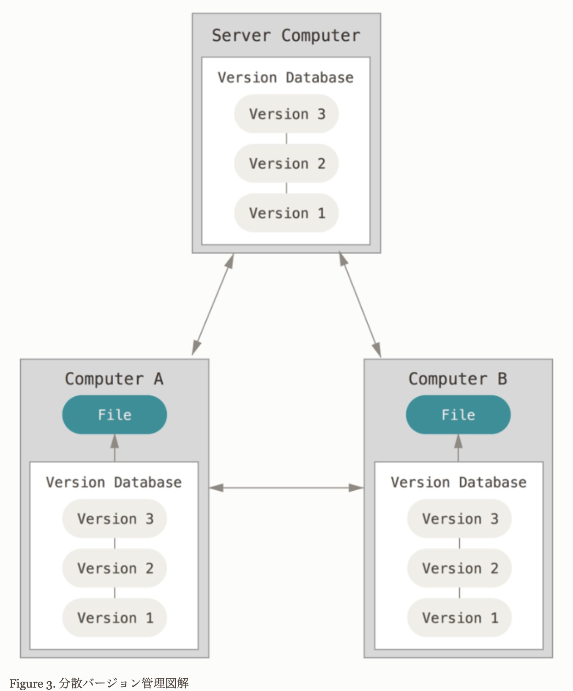

# 今回の目的

 {" "}

- バージョン管理の本質を理解することが目的

 {" "}

# バージョンとは

 {" "}

- そのものがもつ現在の状態

 {" "}

# バージョン管理システム

 {" "}

- バージョン管理とは

 {" "}

- プロジェクトの中で更新されていく様々な成果物の変更の履歴を成果物そのものも含めて記録すること

 {" "}

- 変更（状態）を記録するシステムで、後で特定の記録（状態）を呼び出せるもの　状態遷移記録かつ呼び出し

 {" "}

- これらの管理を自動化したツールの代表的なものとしては、Git、Subversion、CVS などである。一般的にバージョン管理はこれらのツールを使って行われる。

 {" "}

- なぜバージョン管理が誕生したのか

 {" "}

- システム・プロジェクトの状態を簡単に管理するため

 {" "}

# バージョン管理ツールのイメージ　 Git で具体例

 {" "}

# ローカル型バージョン管理

- ローカル環境のサーバー（クライアントのローカル・データベース）でバージョン管理を行う

 {" "}

- なぜ
  - 記録（セーブ）しなければ、常にはじめから実行しなければならないため

 {" "}

- 方法
  - ローカルのデータベースへ任意のファイルについて、それが過去の任意の時点でどういうものだったかということを、パッチ（差分）を重ね上げていくことで再現

 {" "}

- メリット
  - ローカルで管理するので、管理範囲が狭く、管理しやすい

 {" "}

- デメリット
  - 他のシステムを扱う開発者との共同作業がやりにくい
  - ひとつの場所にプロジェクトの全体の履歴を持っているので、すべてを失うリスクがある

 {" "}

# 集中型バージョン管理

- リモート環境の中央サーバーでバージョン管理を行う

 {" "}

- なぜ
  - 他のシステムを扱う開発者との共同作業をするため

 {" "}

- 方法
  - リモートの中央サーバー上で、それぞれのクライアントがパッチ（差分）を重ねあげていくことで再現

 {" "}

- メリット
  - リモートの中央サーバーの管理者はそれぞれのクライアントが何をできるのかについて細かくコントロールできるため、
    すべてのクライアントのローカル・データベースを取り扱うよりずっと簡単

 {" "}

- デメリット
  - リモートの中央サーバーが停止した場合、共同作業も全くできす、作業中のものにバージョンを付けて記録することができなくなる
  - もし中央データベースのハードディスクが破損し、適切なバックアップが保持されていなければ完全にすべてを失う
  - 残るは、ローカルマシンにたまたまあった幾らかの単一スナップショット（ある時点のファイル、ディレクトリの編集対象の状態）くらい
  - ひとつの場所にプロジェクトの全体の履歴を持っているので、すべてを失うリスクがある

 {" "}

# 分散型バージョン管理

- リモート環境の中央サーバーからクローンして、ローカルサーバーでバージョン管理を行う

 {" "}

- なぜ
  - リモートの中央サーバーへの一極依存を解消し、共同作業と障害への対策を簡単に行えるため

 {" "}

- 方法
  - クライアントは最新のスナップショット（ある時点のファイル、ディレクトリの編集対象の状態）をチェックアウト（コピー）するだけでなく
    リポジトリ全体（バージョン管理をする対象のファイル、ディレクトリ、更新履歴などの一群）全体をミラーリングする
  - クローンは全て、実際は全データの完全バックアップ

 {" "}

- メリット
  - リモートの中央サーバー  や、あるサーバーが故障してそのサーバーが分散バージョン管理システム  がそのサーバーを介して連携していたとしても
    どれでもいいのでクライアント・リポジトリのひとつを対象のサーバー  にコピーすれば修復できる
  - 異なった方法で異なる人々のグループと同時に同じプロジェクト内で共同作業することができる
  - このため、階層モデルなどの集中システムでは不可能な幾つかのワークフローが構築できるようなっている

 {" "}

- デメリット
  - クライアントそれぞれに分散バージョン管理システム基本使用方法の理解が必要

 {" "}

# その他バージョン管理するものの例

 {" "}

- OS のバージョン管理ツール

  | OS      | TOOL |
  | ------- | ---- |
  | Windows | ---  |
  | Mac     | ---  |
  | Linux   | ---  |

- 言語のバージョン管理ツール

  | langage | TOOL                    |
  | ------- | ----------------------- |
  | Ruby    | rbenv , rbrew           |
  | PHP     | phpenv , phpbrew        |
  | Python  | pyenv                   |
  | Java    | jenv                    |
  | Swift   | swiftenv                |
  | Go      | goenv                   |
  | Node.js | nodebrew , nvm , nodist |

# まとめ

- バージョン管理とはそのものの状態変化を記録し、タイムスリップしてやり直しまたは新しく創造ができる

# 次回改善点

- Git での具体例だけでなく、その他のユースケースについても理解し、理解を深める
- イメージ画像を挿入する
